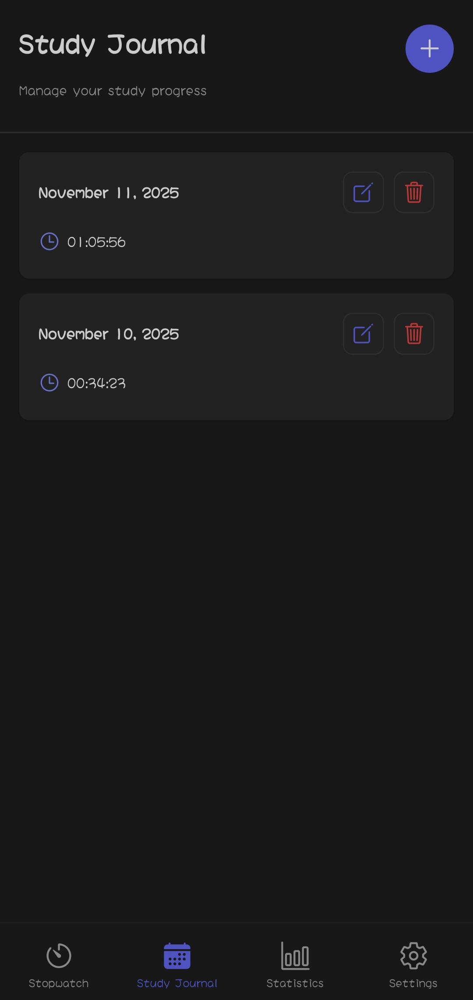
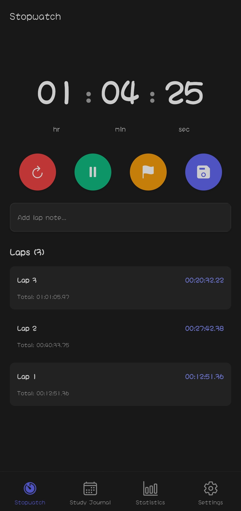
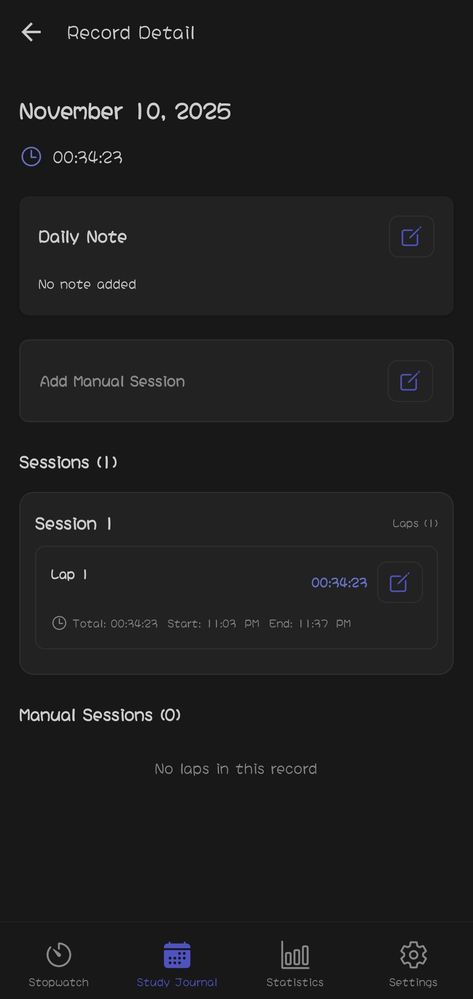
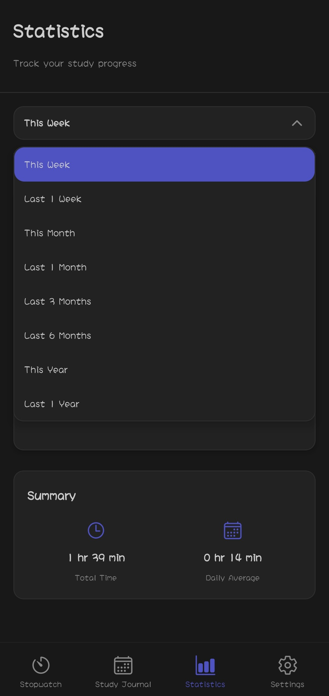
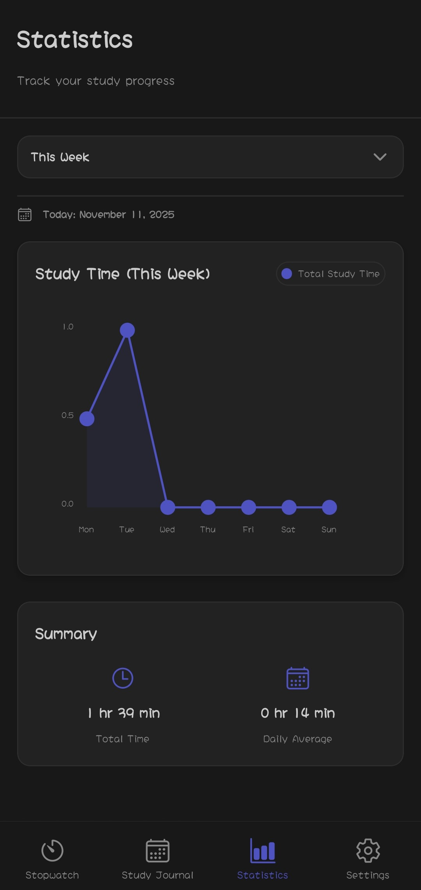
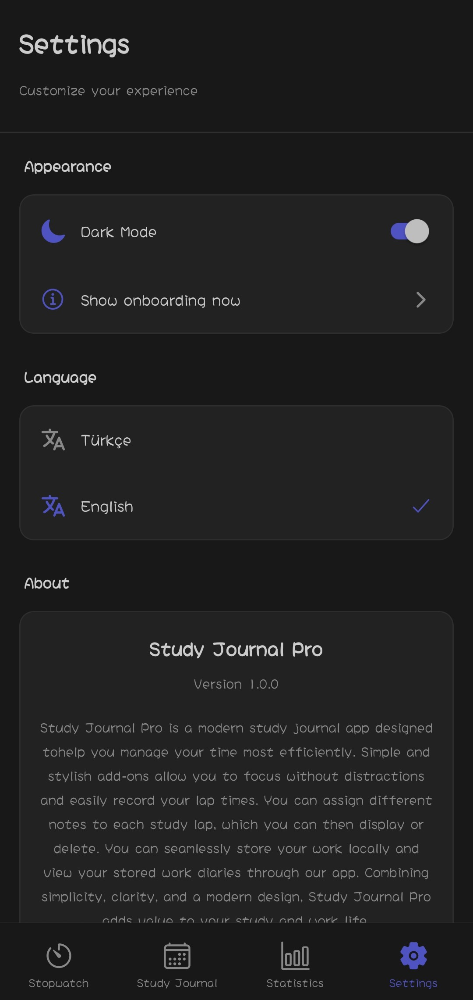
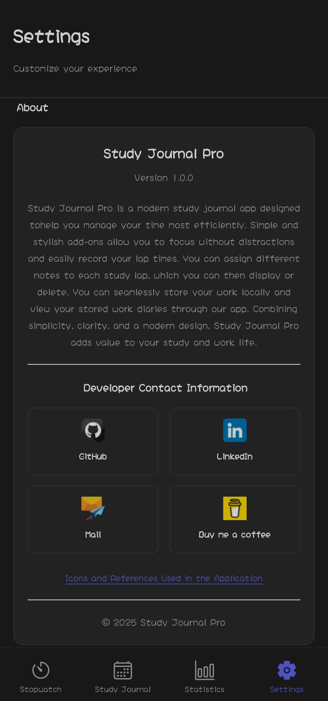

 <a href="https://play.google.com/store/apps/details?id=com.studyjournalpromobile" title="Open on Google Play"></a>

# Study Journal Pro Mobile

A modern, beautiful, and well-structured mobile app built with React Native (Expo) to help users track their study sessions, take notes, and view progress statistics.

## Google Play

<p>
  <a href="https://play.google.com/store/apps/details?id=com.studyjournalpromobile" target="_blank" rel="noopener noreferrer" title="Get it on Google Play">
    
  </a>
</p>


## Features

- **Dark/Light Theme** - Toggle between dark and light mode
- **Study Notes** - Create and manage study notes with duration tracking
- **Statistics** - View your study progress with beautiful charts
- **Local Storage** - All data is stored locally on your device

## Screenshots


In‑app screenshots are under `assets/screenshots/`. Below is a compact two‑column layout:

<table style="border-radius:10px;" >
  <tr>
    <td  align="center">
      
      <br/>
      <em>Home (Study Journal): Main screen with study logs and navigation.</em>
    </td>
    <td  align="center">
      
      <br/>
      <em>Stopwatch: Start/stop timing; record laps; focus‑friendly timer.</em>
    </td>
  </tr>
  <tr>
    <td  align="center">
      
      <br/>
      <em>Record Detail: Duration, notes, and edit options.</em>
    </td>
    <td  align="center">
      
      <br/>
      <em>Statistics Choice: Pick metrics/filters to visualize.</em>
    </td>
  </tr>
  <tr>
    <td  align="center">
      
      <br/>
      <em>Statistics: Charts displaying study progress.</em>
    </td>
    <td  align="center">
      
      <br/>
      <em>Settings: Theme, remove/restore ads, and preferences.</em>
    </td>
  </tr>
  <tr  align="center">
    <td>
      
      <br/>
      <em>About: App version, developer links, and references.</em>
    </td>
    <td></td>
  </tr>
  
</table>

## Project Structure

```
StudyJournalProMobile/
├── App.js                 # Main application entry point
├── src/                   # Source code directory
│   ├── screens/           # App screens
│   │   ├── HomeScreen.js
│   │   ├── AddNoteScreen.js
│   │   ├── StatisticsScreen.js
│   │   ├── SettingsScreen.js
│   ├── components/        # Reusable UI components
│   │   ├── NoteCard.js
│   │   ├── AddButton.js
│   │   ├── ChartCard.js
│   │   ├── AnimatedCard.js
│   ├── context/           # React Context providers
│   │   ├── NotesContext.js
│   │   ├── ThemeContext.js
│   ├── theme/             # Theme configuration
│   │   ├── theme.js
│   └── utils/             # Utility functions
│       ├── storage.js
```

## Installation

1. Make sure you have Node.js and npm installed
2. Install Expo CLI globally:
   ```
   npm install -g expo-cli
   ```
3. Install project dependencies:
   ```
   npm install
   ```
4. Install required dependencies:
   ```
   npx expo install @react-navigation/native @react-navigation/stack @react-navigation/bottom-tabs
   npx expo install react-native-gesture-handler react-native-reanimated react-native-screens
   npx expo install react-native-safe-area-context @react-native-async-storage/async-storage
   npx expo install react-native-chart-kit react-native-svg expo-status-bar
   ```

## Running the App

1. Start the development server:
   ```
   npx expo start
   ```
2. Use Expo Go app on your mobile device to scan the QR code displayed in the terminal
3. Alternatively, press 'a' to run on an Android emulator or 'i' to run on an iOS simulator

## Usage

- **Home Screen**: View your study notes and add new ones
- **Add Note Screen**: Create new study notes with title, content, and duration
- **Statistics Screen**: View charts of your study progress
- **Settings Screen**: Toggle dark/light theme and manage app data

## Technologies Used

- React Native (Expo)
- React Navigation
- AsyncStorage
- React Native Chart Kit
- Animated API for smooth transitions

## License

MIT